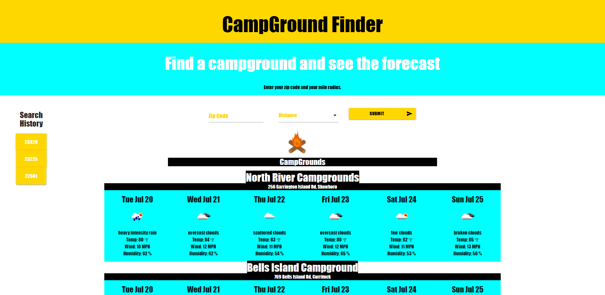

# Water-Finder

## Description

CampGround finder is a small app that will help find campgrounds in a specified search area by zip code. The app will return results based on a zipcode and search radius provided by the user. The app will also return the weather for all search results.

## Instructions

To make the web app function, you must go to https://cors-anywhere.herokuapp.com/corsdemoto to request temporary access. 

Visit [CampGround Finder](https://gaitherdb.github.io/Water-Finder/) to open the app.

Type in the zipcode you want to search and the radius, 50 miles, 100 miles, or 250 miles. The app will also save your past three searches to local storage.

## APIs and Framework

CampGround Finder uses the Places API from google, and the Openweather current day API and onecall API.

https://developers.google.com/maps/documentation/places/web-service/overview
https://openweathermap.org/api

We used Materialize CSS framwork for structure and form inputs. 

https://materializecss.com/

## Contributors

This project was concieved and built by David Gaither, Laeticia Ndutiye, and Ryan Radford.

Contact Info: David Gaither: gaitherdb@gmail.com, Laeticia Ndutiye: 	ndutilae@gmail.com, Ryan Radford: ryanradford84@gmail.com

Instructors from the UofR fullstack bootcamp were instrumental with debugging and troubleshooting.

